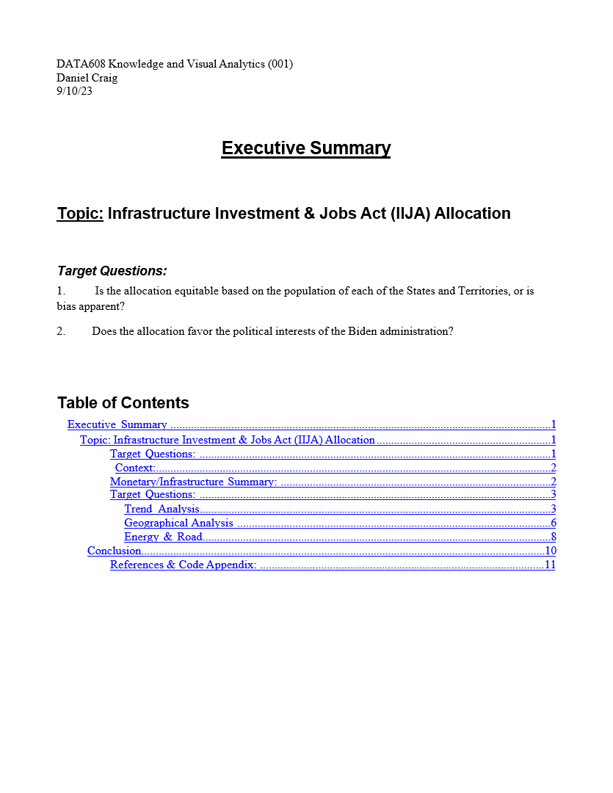
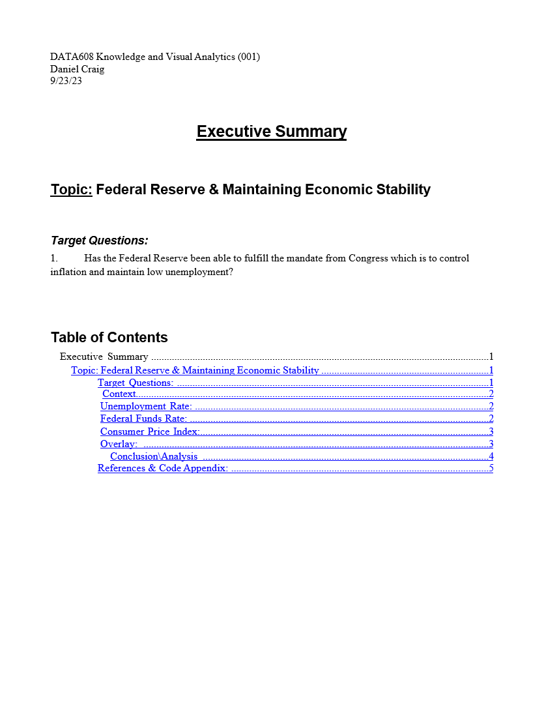
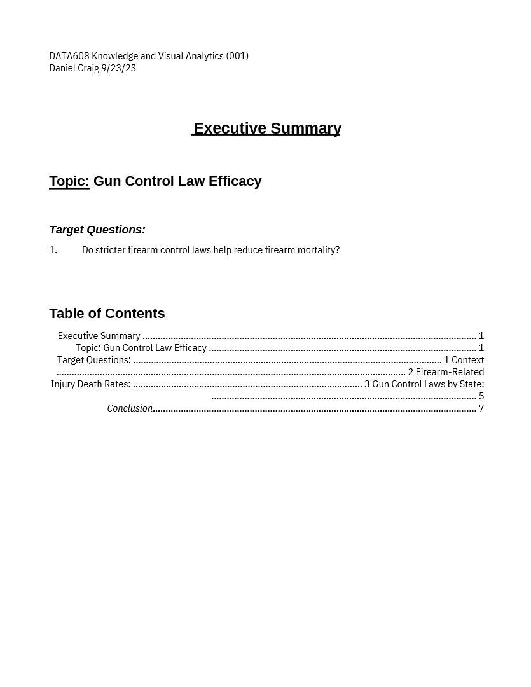

# DATA608 Knowledge & Visual Analytics
This course focused on producing visualizations and building expertise in plotting packages. While a breadth of packages were required, when free choice was allowed I utilized Python's Plotly package.

Below highlights some of the better visualizations, but the markdown will cover most of the major assignments.

## Impact of Storms, Temperature, and Wind Speed over Time
The context behind this assignment was to connect the relationship between rising temperatures and storm intensity. While not all of the images are placed here, a few of the pertinet ones are below.

## What Critical Minerals to the U.S. are sourced from political rivals?
This assignment focused on idnetifying at-risk critical minerals and their sources in the event of war or economic difficulties. Alternative sources, if any, are shown.

Other assignments broken down by stores, can be seen below as rolling gif's with 7 seconds for each image.

## Story 1: Does the allocation of IIJA Funding have political bias?

## Story 2: Has the Federal Reserve fulfilled its mandate of maintaining low unemployment and control inflation?

## Story 3: Do stricter firearm control laws reduce firearm mortality?

## Story 5: Has rising temperatures impacted the intensity of tropical storms?

## Story 6: How does Food Insecurity impact individual success and health in adulthood?

